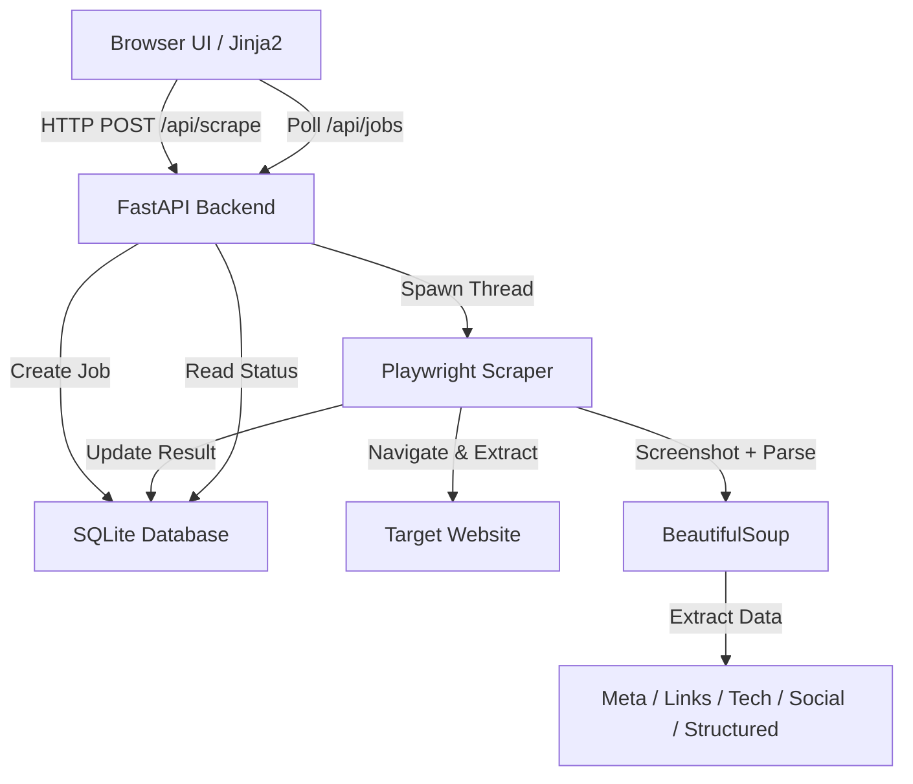

# xcrape - Developer Documentation

> Comprehensive documentation for developers working on xcrape.

**Version:** 0.2.0 | **Last Updated:** 2026-02-23

---

## Table of Contents

- [Architecture Overview](#architecture-overview)
- [Project Structure](#project-structure)
- [Naming Conventions](#naming-conventions)
- [Database Schema](#database-schema)
- [API Reference](#api-reference)
- [Environment Variables](#environment-variables)
- [Configuration](#configuration)
- [Security Practices](#security-practices)
- [Error Handling](#error-handling)
- [Key Components](#key-components)
- [Testing](#testing)
- [Commands](#commands)
- [Intended Changes](#intended-changes)
- [Project Auditing & Quality Standards](#project-auditing--quality-standards)
- [Troubleshooting](#troubleshooting)
- [Contributing](#contributing)

---

## Architecture Overview

xcrape follows a **Modern Monolithic** architecture with an asynchronous backend:



### Key Design Decisions

| Decision | Rationale |
|----------|-----------|
| **FastAPI** | High performance, automatic OpenAPI docs, and excellent async support. |
| **Playwright** | Reliable headless browser automation that handles SPAs better than simple HTTP clients. |
| **aiosqlite** | Non-blocking database interactions to keep the FastAPI event loop responsive. |
| **Threaded Workers** | Scraping is run in background threads to avoid Windows event loop conflicts with Playwright. |
| **BeautifulSoup** | Reliable HTML parsing after Playwright renders the page. |
| **Base64 Screenshots** | Screenshots stored inline in the job data for simplicity (no file server needed). |
| **Lifespan Context** | Uses FastAPI `lifespan` instead of deprecated `on_event("startup")`. |

---

## Project Structure

```
xcrape/
├── xcrape/
│   ├── app/
│   │   ├── data/             # SQLite database storage
│   │   ├── static/           # CSS and Frontend JS
│   │   │   ├── style.css     # Material Design 3 TUI styles
│   │   │   └── script.js     # Frontend logic and data rendering
│   │   ├── templates/        # Jinja2 HTML templates
│   │   │   └── index.html    # Main dashboard template
│   │   ├── __init__.py       # Package init
│   │   ├── db.py             # Database models and queries
│   │   ├── scraper.py        # Playwright scraping logic
│   │   └── main.py           # FastAPI routes and app initialization
│   ├── main.py               # CLI/Entry point script
│   └── pyproject.toml        # Dependency management (uv)
├── TempDocs/                 # Documentation templates
├── README.md                 # User-facing documentation
├── DEVELOPMENT.md            # This file
├── CHANGELOG.md              # Version history
├── TASKS.md                  # Project roadmap
├── LICENSE.md                # License terms
└── .env.example              # Environment variable template
```

---

## Naming Conventions

> Names should be self-documenting. A reader should understand what a file, function, or component does without opening it.

### Files & Directories

| Type | Convention | Good Example | Bad Example |
|------|-----------|--------------|-------------|
| **Routes** | Defined in `main.py` | `/api/scrape`, `/api/jobs/{id}` | `/api/do`, `/api/thing` |
| **Database** | Functional naming in `db.py` | `create_job`, `get_job`, `delete_job` | `do_db`, `query` |
| **Templates** | Snake case | `index.html` | `Page1.html` |
| **Static assets** | Snake case | `script.js`, `style.css` | `app2.js`, `s.css` |

### Functions & Methods

| Prefix | Purpose | Example |
|--------|---------|---------|
| `get` / `fetch` | Retrieve data | `get_jobs()`, `get_job()` |
| `create` | Create a new resource | `create_job()` |
| `update` | Modify existing data | `update_job()` |
| `delete` | Remove a resource | `delete_job()` |
| `run` | Execute logic | `run_scraper()` |
| `_extract` | Internal parsing | `_extract_social_links()`, `_extract_structured_data()` |
| `_detect` | Internal detection | `_detect_technologies()` |
| `render` | Frontend rendering | `renderMeta()`, `renderStats()` |

### Database Models & Fields

| Type | Convention | Example |
|------|-----------|---------|
| **Tables** | Lowercase plural | `jobs` |
| **Fields** | Snake case | `created_at`, `job_id` |
| **Status values** | Lowercase string | `pending`, `running`, `completed`, `failed` |

### Routes & URLs

| Type | Convention | Example |
|------|-----------|---------|
| **API endpoints** | `/api/{resource}` | `/api/jobs`, `/api/jobs/{id}/export` |
| **Page routes** | Root path | `/` |

### Constants & Environment Variables

| Type | Convention | Example |
|------|-----------|---------|
| **Constants** | `UPPER_SNAKE_CASE` | `SOCIAL_DOMAINS`, `TECH_PATTERNS` |
| **Env variables** | `UPPER_SNAKE_CASE` | `DATABASE_URL`, `PORT` |

---

## Database Schema

### Models Overview (1 table)

| Table | Purpose | Key Fields |
|-------|---------|------------|
| **jobs** | Tracks scraping tasks and their results | `id`, `url`, `status`, `data`, `created_at` |

### Fields Detail

| Field | Type | Description |
|-------|------|-------------|
| `id` | INTEGER PRIMARY KEY | Auto-incrementing job identifier |
| `url` | TEXT NOT NULL | Target URL to scrape |
| `status` | TEXT NOT NULL | Job status: `pending`, `running`, `completed`, `failed` |
| `data` | TEXT | JSON-serialized results or structured error object |
| `created_at` | TEXT | ISO 8601 timestamp (auto-set on creation) |

### Migrations

The database auto-migrates on startup. The `init_db()` function in `db.py` checks for missing columns and adds them:

```python
# Auto-migration for created_at column
columns = [row[1] for row in await db.execute_fetchall("PRAGMA table_info(jobs)")]
if "created_at" not in columns:
    await db.execute("ALTER TABLE jobs ADD COLUMN created_at TEXT")
```

---

## API Reference

### Base URL

| Environment | URL |
|-------------|-----|
| Local | `http://localhost:8000/api` |

### Request / Response Format

| Detail | Value |
|--------|-------|
| **Content-Type** | `application/json` |
| **Accept** | `application/json` |
| **Date format** | ISO 8601 (`YYYY-MM-DDTHH:mm:ssZ`) |

### Endpoints

#### Scraping

| Method | Path | Auth | Description |
|--------|------|------|-------------|
| `POST` | `/api/scrape` | None | Create a new scraping job. Body: `{"url": "...", "selector": "..."}` |

#### Jobs

| Method | Path | Auth | Description |
|--------|------|------|-------------|
| `GET` | `/api/jobs` | None | List the most recent 50 jobs. |
| `GET` | `/api/jobs/{id}` | None | Get details of a specific job. |
| `DELETE` | `/api/jobs/{id}` | None | Delete a job from the queue. |
| `POST` | `/api/jobs/{id}/rescrape` | None | Re-scrape the same URL as a new job. |

#### Export

| Method | Path | Auth | Description |
|--------|------|------|-------------|
| `GET` | `/api/jobs/{id}/export?format=json` | None | Download job data as a JSON file. |
| `GET` | `/api/jobs/{id}/export?format=csv` | None | Download job data as a structured CSV file. |

### Error Responses

All errors return a JSON object:

```json
{
  "error": "Job not found"
}
```

| Status | When |
|--------|------|
| `400` | No data available for export |
| `404` | Job not found |

---

## Environment Variables

> [!CAUTION]
> Never commit `.env` files. Use `.env.example` with placeholder values and ensure `.env` is listed in `.gitignore`.

### Optional

| Variable | Description | Default |
|----------|-------------|---------|
| `DATABASE_URL` | SQLite connection string | `sqlite+aiosqlite:///app/data/scraper.db` |
| `PORT` | Server port | `8000` |

---

## Configuration

### Scraper Settings

| Setting | Default | Description |
|---------|---------|-------------|
| Navigation timeout | `30000ms` | Max wait for `networkidle` |
| Fallback timeout | `15000ms` | Max wait for `domcontentloaded` retry |
| Screenshot format | `JPEG (70%)` | Viewport screenshot quality |
| Viewport size | `1280×720` | Browser viewport dimensions |
| Max rows per table | `50` | Cap on extracted table rows |
| Max lists | `20` | Cap on extracted list elements |
| Max paragraphs | `50` | Cap on extracted text paragraphs |

---

## Security Practices

### Input Validation & Sanitization

- All user input is validated at the **API route handler** level
- Pydantic is used for schema validation (`ScrapeRequest` model)
- HTML output is escaped in Jinja2 templates and frontend JS (`escapeHtml()`)

### Authentication & Authorization

- **No authentication** — designed for local-only use
- Should be placed behind a reverse proxy with auth if exposed to a network

### Sensitive Data Handling

- No credentials, tokens, or API keys are hardcoded in the source
- Secrets are loaded from environment variables via `.env`

---

## Error Handling

### Server-Side

| Layer | Strategy |
|-------|----------|
| **Route handlers** | FastAPI returns JSON error responses with appropriate status codes |
| **Scraper** | Broad `try/except` captures all browser/network errors and stores structured error data |
| **Database** | `aiosqlite` transactions ensure data integrity for job updates |
| **Navigation** | Retry with `domcontentloaded` if `networkidle` times out |

### Client-Side

| Layer | Strategy |
|-------|----------|
| **API calls** | Centralized fetch with toast notifications for errors |
| **Forms** | HTML5 validation + disabled submit during processing |
| **Global** | Keyboard shortcuts (Esc), graceful error display in detail panel |

### Scraper Error Format

Failed jobs store a structured JSON error:

```json
{
  "error": "net::ERR_NAME_NOT_RESOLVED",
  "error_type": "Error",
  "load_time_seconds": 2.45
}
```

---

## Key Components

### Scraper (`scraper.py`)

Core data extraction engine using Playwright + BeautifulSoup.

| Function | Description |
|----------|-------------|
| `run_scraper()` | Main entry point — navigates, screenshots, parses, and stores results |
| `_detect_technologies()` | Identifies frameworks/CMS via meta tags, scripts, and DOM markers |
| `_extract_social_links()` | Finds social media profiles from scraped links |
| `_extract_structured_data()` | Extracts JSON-LD, OpenGraph, and Twitter Card metadata |

### Database (`db.py`)

| Function | Description |
|----------|-------------|
| `init_db()` | Creates tables and runs auto-migrations |
| `create_job()` | Inserts a new pending job with timestamp |
| `update_job()` | Updates job status and data |
| `get_jobs()` | Returns the 50 most recent jobs |
| `get_job()` | Returns a single job by ID |
| `delete_job()` | Removes a job from the database |

### Frontend (`script.js`)

| Function | Description |
|----------|-------------|
| `fetchJobs()` | Polls `/api/jobs` and updates the table |
| `renderTab()` | Dispatches to the correct tab renderer |
| `toast()` | Shows Material Design toast notifications |
| `doRescrape()` | Triggers re-scrape via API |

---

## Testing

### Running Tests

```bash
# All tests (planned)
uv run pytest

# With coverage (planned)
uv run pytest --cov=app
```

### What to Test

| Layer | Focus |
|-------|-------|
| **Unit** | `_detect_technologies()`, `_extract_social_links()`, `_extract_structured_data()` |
| **Integration** | API endpoints, database CRUD, export formatting |
| **E2E** | Full scrape flow from form submit to data display |

---

## Commands

### Start Development Server

```bash
cd xcrape/xcrape
uv run uvicorn app.main:app --reload
```

### Install Playwright Browsers

```bash
uv run playwright install chromium
```

### Reset Database

```bash
del xcrape\xcrape\app\data\scraper.db
# Restart the server — DB will be recreated automatically
```

---

## Intended Changes

> Planned changes, upcoming features, and known technical debt. For a complete history of completed changes, see [CHANGELOG.md](CHANGELOG.md).

### Upcoming

| Change | Impact | Target Version |
|--------|--------|----------------|
| Multi-browser support (Firefox, WebKit) | More accurate scraping across engines | `0.3.0` |
| Pagination for job list | Handle 100+ jobs efficiently | `0.3.0` |
| Light theme toggle | M3 light mode support | `0.3.0` |

### Technical Debt

- [ ] Add automated tests (unit + integration)
- [ ] Add proper logging with levels (currently `console.error` only)
- [ ] Type annotations on all Python functions

---

## Project Auditing & Quality Standards

> A structured approach to ensuring the project is correct, secure, and maintainable.

### System Understanding

Before making significant changes, ensure a deep understanding of:
- **Core Architecture**: Workflows, data flow, and overall purpose.
- **Implicit Design**: Assumptions and hidden coupling between components.
- **Edge Cases**: Unintended behaviors and alternative use cases.

### Audit Categories

| Category | Focus Areas |
|----------|-------------|
| **Correctness** | Logical errors, edge-case failures, silent failures, data integrity |
| **Security** | Vulnerabilities, auth flaws, input weaknesses, sensitive data exposure |
| **Performance** | Algorithm efficiency, query optimization, resource overuse (CPU/RAM) |
| **Architecture** | Bottlenecks, tight coupling, structural mismatches, scalability |
| **Maintainability** | Readability, naming consistency, technical debt, dead code |
| **Documentation** | Accuracy, completeness, implementation-spec matching |
| **Infrastructure** | Environment config, deployment risks, secret management |

### Reporting Process

- All audit findings must be added to [TASKS.md](TASKS.md).
- Ensure entries are **Clear**, **Actionable**, and **Concisely described**.
- Avoid vague statements; provide concrete context and impact.

---

## Troubleshooting

### Common Issues

| Issue | Solution |
|-------|----------|
| **`uv` command not found** | Install uv: `curl -LsSf https://astral.sh/uv/install.sh \| sh` or check `C:\Users\<user>\AppData\Local\uv\uv.exe` |
| **Playwright browsers not installed** | Run `uv run playwright install chromium` |
| **Database schema changed** | Delete the old DB file and restart: `del app\data\scraper.db` |
| **Screenshots not captured** | Ensure Chromium is installed and has sufficient memory |
| **Windows event loop errors** | The threaded worker design should handle this — file an issue if it persists |

### Debug Mode

```bash
uv run uvicorn app.main:app --reload --log-level debug
```
---

<p align="center">
  <a href="README.md">← Back to README</a>
</p>
