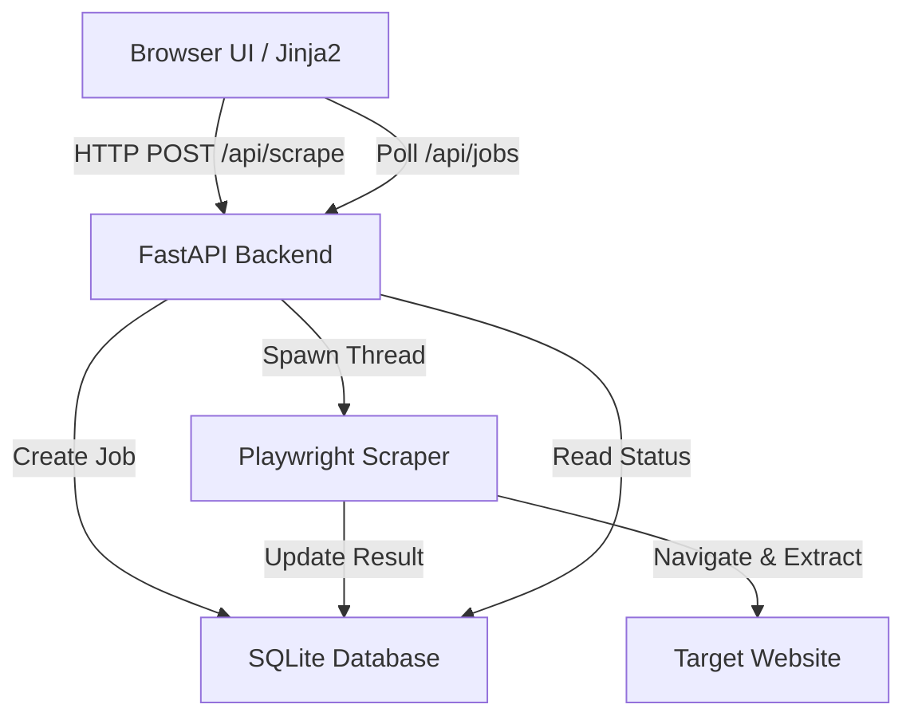

# xcrape - Developer Documentation

> Comprehensive documentation for developers working on xcrape.

**Version:** 0.1.0 | **Last Updated:** 2026-02-23

---

## Table of Contents

- [Architecture Overview](#architecture-overview)
- [Project Structure](#project-structure)
- [Naming Conventions](#naming-conventions)
- [Database Schema](#database-schema)
- [API Reference](#api-reference)
- [Environment Variables](#environment-variables)
- [Security Practices](#security-practices)
- [Error Handling](#error-handling)
- [Testing](#testing)

---

## Architecture Overview

xcrape follows a **Modern Monolithic** architecture with an asynchronous backend:



### Key Design Decisions

| Decision | Rationale |
|----------|-----------|
| **FastAPI** | High performance, automatic OpenAPI docs, and excellent async support. |
| **Playwright** | Reliable headless browser automation that handles SPAs better than simple HTTP clients. |
| **aiosqlite** | Non-blocking database interactions to keep the FastAPI event loop responsive. |
| **Threaded Workers** | Scraping is run in background threads to avoid Windows event loop conflicts with Playwright. |

---

## Project Structure

```
xcrape/
├── xcrape/
│   ├── app/
│   │   ├── data/             # SQLite database storage
│   │   ├── static/           # CSS and Frontend JS
│   │   ├── templates/        # Jinja2 HTML templates
│   │   ├── db.py             # Database models and queries
│   │   ├── scraper.py        # Playwright scraping logic
│   │   └── main.py           # FastAPI routes and app initialization
│   ├── main.py              # CLI/Entry point script
│   └── pyproject.toml        # Dependency management (uv)
├── README.md                 # User-facing documentation
├── DEVELOPMENT.md            # This file
├── CHANGELOG.md              # Version history
├── LICENSE.md                # License terms
└── TASKS.md                  # Project roadmap
```

---

## Naming Conventions

### Files & Directories

| Type | Convention | Good Example |
|------|-----------|--------------|
| **Routes** | Defined in `main.py` | `/api/scrape`, `/api/jobs` |
| **Database** | Functional naming in `db.py` | `create_job`, `get_job` |
| **Templates** | Snake case | `index.html`, `job_detail.html` |

### Functions & Methods

| Prefix | Purpose | Example |
|--------|---------|---------|
| `get` | Retrieve data | `get_jobs()`, `get_job()` |
| `create` | Create a new resource | `create_job()` |
| `update` | Modify existing data | `update_job()` |
| `run` | Execute logic | `run_scraper()` |

---

## Database Schema

### Models Overview (SQLite)

| Table | Purpose | Key Fields |
|-------|---------|------------|
| **jobs** | Tracks scraping tasks and results | `id`, `url`, `status`, `data` |

### Fields detail

- `id`: INTEGER PRIMARY KEY
- `url`: TEXT (Target URL)
- `status`: TEXT (`pending`, `running`, `completed`, `failed`)
- `data`: TEXT (JSON serialized results or error message)

---

## API Reference

### Base URL
`http://localhost:8000/api`

### Endpoints

| Method | Path | Auth | Description |
|--------|------|------|-------------|
| `POST` | `/scrape` | None | Create a new scraping job. Expects `{"url": "...", "selector": "..."}` |
| `GET` | `/jobs` | None | Lists the most recent 50 scraping jobs. |

---

## Environment Variables

### Optional

| Variable | Description | Default |
|----------|-------------|---------|
| `PORT` | Port for the FastAPI server | `8000` |

---

## Security Practices

- **Local Host Only**: The app is designed for local use.
- **Input Validation**: URL validation is performed by Pydantic.
- **Headless Isolation**: Playwright runs in headless mode to minimize system exposure.

---

## Error Handling

### Scraper
The `run_scraper` function uses a broad `try/catch` block to capture any browser or network errors and log them into the `data` field of the job with a `failed` status.

### Database
Simple `aiosqlite` transactions ensure data integrity for job status updates.

---

## Testing

```bash
# Run tests (planned)
uv run pytest
```

---

<p align="center">
  <a href="README.md">← Back to README</a>
</p>
