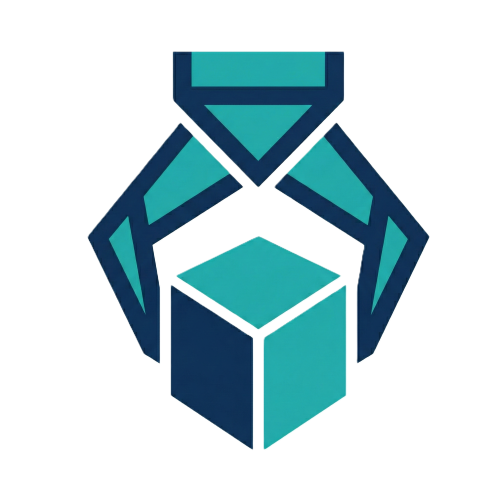

<p align="center">
  
</p>

<h1 align="center"><a href="http://localhost:8000">xcrape</a></h1>

<p align="center">
  Smart Local Web Scraper — Comprehensive page analysis with a Material Design 3 terminal UI
</p>

<p align="center">
  
  
  
  
</p>

> [!NOTE]
> **Personal Project** 🎯 I built this to provide a lightweight, locally-hosted tool for dynamic web scraping without relying on external SaaS platforms.

> [!WARNING]
> **Local Testing Only** — This tool has only been tested against locally-hosted HTML websites. It is **not** designed or intended for scraping production websites on the internet.

> [!CAUTION]
> **Do not scrape real websites.** Scraping live sites without permission may violate their Terms of Service, get your IP blocked, or have legal consequences. Use this tool responsibly on your own local projects only.

## Live Website

**➡️ [http://localhost:8000](http://localhost:8000)**

> **Live Demo Limitations**: This app is intended to be run locally. Remote access should be secured properly.

---

## ✨ Features

| Feature | Description |
|---------|-------------|
| 🕷️ **Dynamic Scraping** | Uses Playwright (Chromium) to handle JavaScript-heavy sites and SPAs. |
| 📸 **Screenshot Capture** | Takes a JPEG screenshot of every scraped page. |
| 🧠 **Technology Detection** | Identifies 15+ frameworks/CMS (React, Vue, Next.js, WordPress, Shopify, etc.). |
| 🔗 **Social Link Detection** | Extracts social media profiles (Twitter, GitHub, LinkedIn, YouTube, etc.). |
| 📊 **Structured Data** | Extracts JSON-LD, OpenGraph, and Twitter Card metadata. |
| 📋 **Comprehensive Extraction** | Meta tags, headings, all links, images, tables, lists, text, and page stats. |
| 💾 **Local Persistence** | SQLite database with timestamps via aiosqlite. |
| ⚡ **Async Architecture** | FastAPI with threaded Playwright workers for concurrent processing. |
| 📤 **CSV/JSON Export** | Download scraped data as structured CSV or JSON files. |
| 🖼️ **Image Download** | Download scraped images individually or as a bulk ZIP archive. |
| 🔄 **Re-scrape** | One-click re-scrape of any previous URL. |
| 🔎 **Search & Filter** | Filter jobs by URL or status in real-time. |
| 📋 **Copy to Clipboard** | Per-section copy buttons for quick data extraction. |
| 🎨 **Material Design 3 TUI** | Terminal-themed UI with M3 dark tonal palette and responsive layout. |

---

## 🚀 Quick Start

### Prerequisites

| Tool | Version | Install |
|------|---------|---------|
| uv | `>=0.5.0` | [Install uv](https://github.com/astral-sh/uv) |
| Python | `>=3.12` | Included via uv |

### Setup

```bash
# Clone and navigate
git clone https://github.com/qtremors/xcrape.git
cd xcrape/xcrape

# Install dependencies
uv sync

# Setup environment
cp ../.env.example ../.env
# Fill in any required values

# Install Playwright browsers
uv run playwright install chromium

# Run the project
uv run uvicorn app.main:app --reload
```

Visit **http://localhost:8000**

### Environment Variables

| Variable | Required | Description |
|----------|----------|-------------|
| `DATABASE_URL` | No | SQLite database path (default: `sqlite+aiosqlite:///app/data/scraper.db`) |
| `PORT` | No | Port to run the server on (default: `8000`) |

---

## 🛠️ Tech Stack

| Layer | Technology |
|-------|------------|
| **Backend** | FastAPI, Pydantic, aiosqlite |
| **Scraper** | Playwright (Chromium), BeautifulSoup4 |
| **Frontend** | Jinja2 Templates, Vanilla CSS/JS, Material Design 3 |
| **Typography** | JetBrains Mono, Material Symbols |
| **Tooling** | Astral uv |

---

## 📁 Project Structure

```
xcrape/
├── xcrape/               # Source code
│   ├── app/              # FastAPI application
│   │   ├── data/         # SQLite database storage
│   │   ├── static/       # CSS, JS assets
│   │   ├── templates/    # Jinja2 HTML templates
│   │   ├── db.py         # Database models and queries
│   │   ├── scraper.py    # Playwright scraping logic
│   │   └── main.py       # FastAPI routes and app init
│   ├── main.py           # Entry point
│   └── pyproject.toml    # Dependency management (uv)
├── TempDocs/             # Documentation templates
├── DEVELOPMENT.md        # Developer documentation
├── CHANGELOG.md          # Version history
├── TASKS.md              # Planned features and known issues
├── LICENSE.md            # License terms
└── README.md
```

---

## 📊 System Resources

| Metric | Value |
|--------|-------|
| **CPU** | Low (<10%) |
| **RAM** | ~100MB + Browser |
| **Disk** | Minimal (SQLite) |

---

## 🧪 Testing

```bash
# Run tests (planned)
uv run pytest
```

---

## 📚 Documentation

| Document | Description |
|----------|-------------|
| [DEVELOPMENT.md](DEVELOPMENT.md) | Architecture, API reference, conventions |
| [CHANGELOG.md](CHANGELOG.md) | Version history and release notes |
| [TASKS.md](TASKS.md) | Planned features and known issues |
| [LICENSE.md](LICENSE.md) | License terms and attribution |

---

## 📄 License

**Tremors Source License (TSL)** - Source-available license allowing viewing, forking, and derivative works with **mandatory attribution**. Commercial use requires written permission.

Web Version: [github.com/qtremors/license](https://github.com/qtremors/license)

See [LICENSE.md](LICENSE.md) for full terms.

---

<p align="center">
  Made with ❤️ by <a href="https://github.com/qtremors">Tremors</a>
</p>
